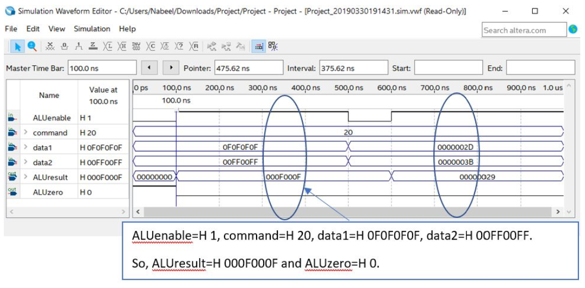
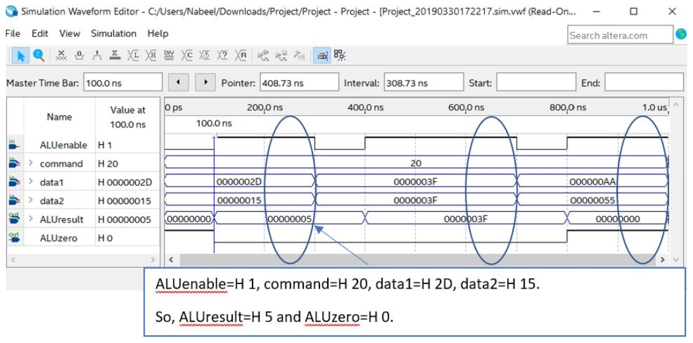

# CPU-Design
CPU designed and developed using Verilog in Quartus Prime Lite

Designed, developed and tested a Verilog CPU in Quartus Prime Lite

The CPU design consisted of different modules that were linked to create a functional CPU

